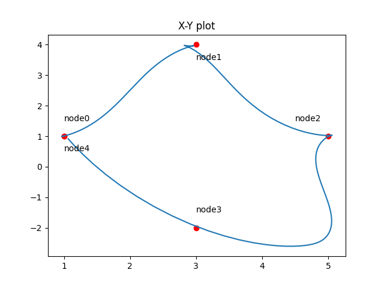
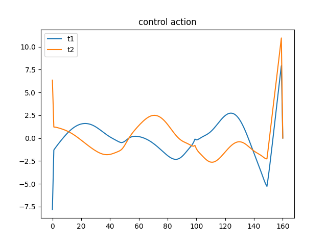
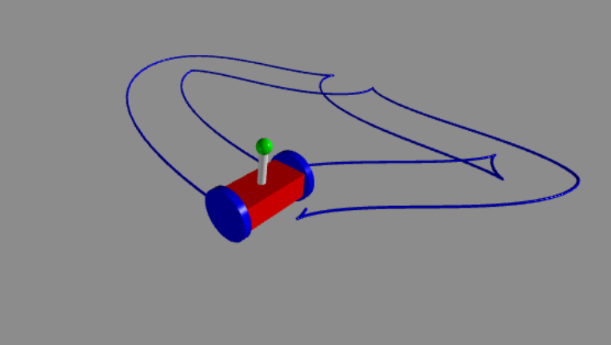

# Structure-Preserving-Control
Optimal control of a Wheeled Inverted Pendulum discretized via Variational Integrator technique.

    
    

  

More details in [UR_final_report.pdf](https://github.com/0xbadc0ffe/Structure-Preserving-Control/blob/main/UR_final_report.pdf), where we developed also an explicit closed form representation of the WIP model under Lie Group Variational Integration.
